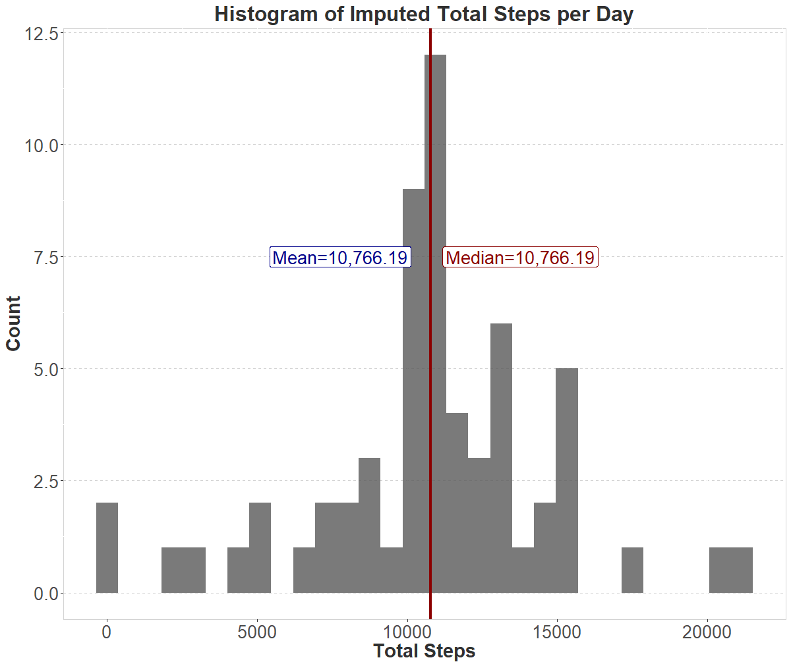

<style type="text/css">
    caption {
      color: #303030;
      font-size: 0.8em;
      text-align: center;
    } 
    table{
      border: 0.75px solid #303030;
      font-size: 14px;
    }
</style>


### **Loading and preprocessing the data**


```r
library(readr)
activity <- read_csv("C:/Users/pdonato/Desktop/Coursera/RepData_PeerAssessment1/activity.zip")
activity$date <- as.Date(activity$date,format="%Y %b %d")
```

The process starts with loading the data and changing the format of the date to make it easier to read. Missing values are not yet treated.

### **What is mean total number of steps taken per day?**


```r
total_steps <- activity %>%
  group_by(date) %>%
  summarise(totsteps = sum(steps, na.rm=TRUE))

kable(total_steps, 
      col.names = c("Date","Total Steps"),
      format.args = list(big.mark = ","),
      caption = "Table 1. Total Steps per Day",
      align = "cl") %>% 
  kable_styling(bootstrap_options = c("striped", "hover"), full_width = F, font_size = 15) %>% 
  column_spec(1, width = "5cm") %>%
  column_spec(2, width = "5cm") %>%
  row_spec(0, align = "c")
```

<table class="table table-striped table-hover" style="font-size: 15px; width: auto !important; margin-left: auto; margin-right: auto;">
<caption style="font-size: initial !important;">Table 1. Total Steps per Day</caption>
 <thead>
  <tr>
   <th style="text-align:center;text-align: center;"> Date </th>
   <th style="text-align:left;text-align: center;"> Total Steps </th>
  </tr>
 </thead>
<tbody>
  <tr>
   <td style="text-align:center;width: 5cm; "> 2012-10-01 </td>
   <td style="text-align:left;width: 5cm; "> 0 </td>
  </tr>
  <tr>
   <td style="text-align:center;width: 5cm; "> 2012-10-02 </td>
   <td style="text-align:left;width: 5cm; "> 126 </td>
  </tr>
  <tr>
   <td style="text-align:center;width: 5cm; "> 2012-10-03 </td>
   <td style="text-align:left;width: 5cm; "> 11,352 </td>
  </tr>
  <tr>
   <td style="text-align:center;width: 5cm; "> 2012-10-04 </td>
   <td style="text-align:left;width: 5cm; "> 12,116 </td>
  </tr>
  <tr>
   <td style="text-align:center;width: 5cm; "> 2012-10-05 </td>
   <td style="text-align:left;width: 5cm; "> 13,294 </td>
  </tr>
  <tr>
   <td style="text-align:center;width: 5cm; "> 2012-10-06 </td>
   <td style="text-align:left;width: 5cm; "> 15,420 </td>
  </tr>
  <tr>
   <td style="text-align:center;width: 5cm; "> 2012-10-07 </td>
   <td style="text-align:left;width: 5cm; "> 11,015 </td>
  </tr>
  <tr>
   <td style="text-align:center;width: 5cm; "> 2012-10-08 </td>
   <td style="text-align:left;width: 5cm; "> 0 </td>
  </tr>
  <tr>
   <td style="text-align:center;width: 5cm; "> 2012-10-09 </td>
   <td style="text-align:left;width: 5cm; "> 12,811 </td>
  </tr>
  <tr>
   <td style="text-align:center;width: 5cm; "> 2012-10-10 </td>
   <td style="text-align:left;width: 5cm; "> 9,900 </td>
  </tr>
  <tr>
   <td style="text-align:center;width: 5cm; "> 2012-10-11 </td>
   <td style="text-align:left;width: 5cm; "> 10,304 </td>
  </tr>
  <tr>
   <td style="text-align:center;width: 5cm; "> 2012-10-12 </td>
   <td style="text-align:left;width: 5cm; "> 17,382 </td>
  </tr>
  <tr>
   <td style="text-align:center;width: 5cm; "> 2012-10-13 </td>
   <td style="text-align:left;width: 5cm; "> 12,426 </td>
  </tr>
  <tr>
   <td style="text-align:center;width: 5cm; "> 2012-10-14 </td>
   <td style="text-align:left;width: 5cm; "> 15,098 </td>
  </tr>
  <tr>
   <td style="text-align:center;width: 5cm; "> 2012-10-15 </td>
   <td style="text-align:left;width: 5cm; "> 10,139 </td>
  </tr>
  <tr>
   <td style="text-align:center;width: 5cm; "> 2012-10-16 </td>
   <td style="text-align:left;width: 5cm; "> 15,084 </td>
  </tr>
  <tr>
   <td style="text-align:center;width: 5cm; "> 2012-10-17 </td>
   <td style="text-align:left;width: 5cm; "> 13,452 </td>
  </tr>
  <tr>
   <td style="text-align:center;width: 5cm; "> 2012-10-18 </td>
   <td style="text-align:left;width: 5cm; "> 10,056 </td>
  </tr>
  <tr>
   <td style="text-align:center;width: 5cm; "> 2012-10-19 </td>
   <td style="text-align:left;width: 5cm; "> 11,829 </td>
  </tr>
  <tr>
   <td style="text-align:center;width: 5cm; "> 2012-10-20 </td>
   <td style="text-align:left;width: 5cm; "> 10,395 </td>
  </tr>
  <tr>
   <td style="text-align:center;width: 5cm; "> 2012-10-21 </td>
   <td style="text-align:left;width: 5cm; "> 8,821 </td>
  </tr>
  <tr>
   <td style="text-align:center;width: 5cm; "> 2012-10-22 </td>
   <td style="text-align:left;width: 5cm; "> 13,460 </td>
  </tr>
  <tr>
   <td style="text-align:center;width: 5cm; "> 2012-10-23 </td>
   <td style="text-align:left;width: 5cm; "> 8,918 </td>
  </tr>
  <tr>
   <td style="text-align:center;width: 5cm; "> 2012-10-24 </td>
   <td style="text-align:left;width: 5cm; "> 8,355 </td>
  </tr>
  <tr>
   <td style="text-align:center;width: 5cm; "> 2012-10-25 </td>
   <td style="text-align:left;width: 5cm; "> 2,492 </td>
  </tr>
  <tr>
   <td style="text-align:center;width: 5cm; "> 2012-10-26 </td>
   <td style="text-align:left;width: 5cm; "> 6,778 </td>
  </tr>
  <tr>
   <td style="text-align:center;width: 5cm; "> 2012-10-27 </td>
   <td style="text-align:left;width: 5cm; "> 10,119 </td>
  </tr>
  <tr>
   <td style="text-align:center;width: 5cm; "> 2012-10-28 </td>
   <td style="text-align:left;width: 5cm; "> 11,458 </td>
  </tr>
  <tr>
   <td style="text-align:center;width: 5cm; "> 2012-10-29 </td>
   <td style="text-align:left;width: 5cm; "> 5,018 </td>
  </tr>
  <tr>
   <td style="text-align:center;width: 5cm; "> 2012-10-30 </td>
   <td style="text-align:left;width: 5cm; "> 9,819 </td>
  </tr>
  <tr>
   <td style="text-align:center;width: 5cm; "> 2012-10-31 </td>
   <td style="text-align:left;width: 5cm; "> 15,414 </td>
  </tr>
  <tr>
   <td style="text-align:center;width: 5cm; "> 2012-11-01 </td>
   <td style="text-align:left;width: 5cm; "> 0 </td>
  </tr>
  <tr>
   <td style="text-align:center;width: 5cm; "> 2012-11-02 </td>
   <td style="text-align:left;width: 5cm; "> 10,600 </td>
  </tr>
  <tr>
   <td style="text-align:center;width: 5cm; "> 2012-11-03 </td>
   <td style="text-align:left;width: 5cm; "> 10,571 </td>
  </tr>
  <tr>
   <td style="text-align:center;width: 5cm; "> 2012-11-04 </td>
   <td style="text-align:left;width: 5cm; "> 0 </td>
  </tr>
  <tr>
   <td style="text-align:center;width: 5cm; "> 2012-11-05 </td>
   <td style="text-align:left;width: 5cm; "> 10,439 </td>
  </tr>
  <tr>
   <td style="text-align:center;width: 5cm; "> 2012-11-06 </td>
   <td style="text-align:left;width: 5cm; "> 8,334 </td>
  </tr>
  <tr>
   <td style="text-align:center;width: 5cm; "> 2012-11-07 </td>
   <td style="text-align:left;width: 5cm; "> 12,883 </td>
  </tr>
  <tr>
   <td style="text-align:center;width: 5cm; "> 2012-11-08 </td>
   <td style="text-align:left;width: 5cm; "> 3,219 </td>
  </tr>
  <tr>
   <td style="text-align:center;width: 5cm; "> 2012-11-09 </td>
   <td style="text-align:left;width: 5cm; "> 0 </td>
  </tr>
  <tr>
   <td style="text-align:center;width: 5cm; "> 2012-11-10 </td>
   <td style="text-align:left;width: 5cm; "> 0 </td>
  </tr>
  <tr>
   <td style="text-align:center;width: 5cm; "> 2012-11-11 </td>
   <td style="text-align:left;width: 5cm; "> 12,608 </td>
  </tr>
  <tr>
   <td style="text-align:center;width: 5cm; "> 2012-11-12 </td>
   <td style="text-align:left;width: 5cm; "> 10,765 </td>
  </tr>
  <tr>
   <td style="text-align:center;width: 5cm; "> 2012-11-13 </td>
   <td style="text-align:left;width: 5cm; "> 7,336 </td>
  </tr>
  <tr>
   <td style="text-align:center;width: 5cm; "> 2012-11-14 </td>
   <td style="text-align:left;width: 5cm; "> 0 </td>
  </tr>
  <tr>
   <td style="text-align:center;width: 5cm; "> 2012-11-15 </td>
   <td style="text-align:left;width: 5cm; "> 41 </td>
  </tr>
  <tr>
   <td style="text-align:center;width: 5cm; "> 2012-11-16 </td>
   <td style="text-align:left;width: 5cm; "> 5,441 </td>
  </tr>
  <tr>
   <td style="text-align:center;width: 5cm; "> 2012-11-17 </td>
   <td style="text-align:left;width: 5cm; "> 14,339 </td>
  </tr>
  <tr>
   <td style="text-align:center;width: 5cm; "> 2012-11-18 </td>
   <td style="text-align:left;width: 5cm; "> 15,110 </td>
  </tr>
  <tr>
   <td style="text-align:center;width: 5cm; "> 2012-11-19 </td>
   <td style="text-align:left;width: 5cm; "> 8,841 </td>
  </tr>
  <tr>
   <td style="text-align:center;width: 5cm; "> 2012-11-20 </td>
   <td style="text-align:left;width: 5cm; "> 4,472 </td>
  </tr>
  <tr>
   <td style="text-align:center;width: 5cm; "> 2012-11-21 </td>
   <td style="text-align:left;width: 5cm; "> 12,787 </td>
  </tr>
  <tr>
   <td style="text-align:center;width: 5cm; "> 2012-11-22 </td>
   <td style="text-align:left;width: 5cm; "> 20,427 </td>
  </tr>
  <tr>
   <td style="text-align:center;width: 5cm; "> 2012-11-23 </td>
   <td style="text-align:left;width: 5cm; "> 21,194 </td>
  </tr>
  <tr>
   <td style="text-align:center;width: 5cm; "> 2012-11-24 </td>
   <td style="text-align:left;width: 5cm; "> 14,478 </td>
  </tr>
  <tr>
   <td style="text-align:center;width: 5cm; "> 2012-11-25 </td>
   <td style="text-align:left;width: 5cm; "> 11,834 </td>
  </tr>
  <tr>
   <td style="text-align:center;width: 5cm; "> 2012-11-26 </td>
   <td style="text-align:left;width: 5cm; "> 11,162 </td>
  </tr>
  <tr>
   <td style="text-align:center;width: 5cm; "> 2012-11-27 </td>
   <td style="text-align:left;width: 5cm; "> 13,646 </td>
  </tr>
  <tr>
   <td style="text-align:center;width: 5cm; "> 2012-11-28 </td>
   <td style="text-align:left;width: 5cm; "> 10,183 </td>
  </tr>
  <tr>
   <td style="text-align:center;width: 5cm; "> 2012-11-29 </td>
   <td style="text-align:left;width: 5cm; "> 7,047 </td>
  </tr>
  <tr>
   <td style="text-align:center;width: 5cm; "> 2012-11-30 </td>
   <td style="text-align:left;width: 5cm; "> 0 </td>
  </tr>
</tbody>
</table>


```r
ggplot(data=total_steps, aes(x=totsteps, y=..count..)) + 
  geom_histogram(alpha=0.8) +
  geom_vline(xintercept=mean(total_steps$totsteps), size=1.5, color="darkblue") +
  geom_vline(xintercept=median(total_steps$totsteps), size=1.5, color="darkred") +
  geom_label(aes(x=median(total_steps$totsteps), y=7.5, 
                 label=paste0("Median=",median(total_steps$totsteps)%>% format(big.mark=","))),
            nudge_x = 3000,
            color = "darkred",
            show.legend = FALSE,
            size=7) +
  geom_label(aes(x=mean(total_steps$totsteps), y=7.5,
                 label=paste0("Mean=",mean(total_steps$totsteps) %>% format(big.mark=","))),
            nudge_x = -3000,
            color = "darkblue",
            show.legend = FALSE,
            size=7) +
  xlab("Total Steps") +
  ylab("Count") +
  ggtitle("Histogram of Total Steps per Day") +
  theme(axis.text.x = element_text(vjust = 0.5,size=20),
        text = element_text(family = "sans", color = "#303030", size = 20),
        title = element_text(face = "bold", color = "#303030", size = 23),
        axis.text=element_text(size=20),
        axis.title = element_text(size=22, face="bold"),
        plot.title = element_text(size=24, hjust = 0.5),
        plot.subtitle = element_text(face="italic"),
        plot.caption = element_text(hjust = 0, size=22, color ="#3A5199",face="italic"),
        panel.background = element_rect(fill="white", color ="#D3D3D3"),
        panel.grid.major.y = element_line(colour="#D3D3D3",linetype = "dashed"),
        strip.text.x = element_text(size = 20))
```

<!-- -->


```r
mean <- mean(total_steps$totsteps) %>% format(big.mark=",")
median <- median(total_steps$totsteps) %>% format(big.mark=",")
```

The histogram shows that the steps data is dominated with 0, with a mean of 9,354.23 and a median of 10,395. Intuitively, the mean and the median should be near 0, however, since missing values are ignored, this histogram is rather misleading.

### **What is the average daily activity pattern?**

```r
daily_pattern <- activity %>%
  group_by(interval) %>%
  summarise(ave=mean(steps,na.rm=TRUE))

ggplot(data=daily_pattern, aes(x=interval, y=ave)) +
  geom_line(size=1.5,color="#303030",alpha=0.8) +
  geom_point(x=daily_pattern[which.max(daily_pattern$ave),1] %>% as.numeric(),
             y=max(daily_pattern$ave),
             size=6, color="darkblue") +
  geom_label(aes(x=daily_pattern[which.max(daily_pattern$ave),1] %>% as.numeric(), 
                 y=max(daily_pattern$ave),
                 label=paste0(max(daily_pattern$ave) %>% format(big.mark=",")," steps")),
            nudge_x = 300,
            color = "darkblue",
            show.legend = FALSE,
            size=7) +
  xlab("Interval") +
  ylab("Average Steps") +
  ggtitle("Average Daily Activity Pattern") +
  theme(axis.text.x = element_text(vjust = 0.5,size=20),
        text = element_text(family = "sans", color = "#303030", size = 20),
        title = element_text(face = "bold", color = "#303030", size = 23),
        axis.text=element_text(size=20),
        axis.title = element_text(size=22, face="bold"),
        plot.title = element_text(size=24, hjust = 0.5),
        plot.subtitle = element_text(face="italic"),
        plot.caption = element_text(hjust = 0, size=22, color ="#3A5199",face="italic"),
        panel.background = element_rect(fill="white", color ="#D3D3D3"),
        panel.grid.major.y = element_line(colour="#D3D3D3",linetype = "dashed"),
        strip.text.x = element_text(size = 20))
```

<!-- -->


```r
max <- daily_pattern[which.max(daily_pattern$ave),1] %>% as.numeric()
```

A typical day shows a peak in activity at early morning at 835AM, steeply going down at around 10AM. Steps start to gradually slow down at around 8PM.

### **Imputing missing values**


```r
missing <- sum(is.na(activity))
```

There are 2304 values of steps in the activity data.


```r
daily_pattern <- activity %>%
  group_by(interval) %>%
  summarise(ave=mean(steps,na.rm=TRUE))

imputed_df <- left_join(activity,daily_pattern) %>%
  mutate(imputed_steps = ifelse(is.na(steps),ave,steps)) %>%
  select(date,interval,imputed_steps)

imputed_df_head <- left_join(activity,daily_pattern) %>%
  mutate(imputed_steps = ifelse(is.na(steps),ave,steps)) %>%
  select(date,interval,imputed_steps) %>% 
  head(10)

kable(imputed_df_head, 
      col.names = c("Date","Interval","Imputed Steps"),
      format.args = list(big.mark = ","),
      caption = "Table 2. First 10 Rows of Activity Data with Imputed Steps",
      align = "ccl") %>% 
  kable_styling(bootstrap_options = c("striped", "hover"), full_width = F, font_size = 15) %>% 
  column_spec(1, width = "5cm") %>%
  column_spec(2, width = "5cm") %>%
  column_spec(3, width = "5cm") %>%
  row_spec(0, align = "c")
```

<table class="table table-striped table-hover" style="font-size: 15px; width: auto !important; margin-left: auto; margin-right: auto;">
<caption style="font-size: initial !important;">Table 2. First 10 Rows of Activity Data with Imputed Steps</caption>
 <thead>
  <tr>
   <th style="text-align:center;text-align: center;"> Date </th>
   <th style="text-align:center;text-align: center;"> Interval </th>
   <th style="text-align:left;text-align: center;"> Imputed Steps </th>
  </tr>
 </thead>
<tbody>
  <tr>
   <td style="text-align:center;width: 5cm; "> 2012-10-01 </td>
   <td style="text-align:center;width: 5cm; "> 0 </td>
   <td style="text-align:left;width: 5cm; "> 1.7169811 </td>
  </tr>
  <tr>
   <td style="text-align:center;width: 5cm; "> 2012-10-01 </td>
   <td style="text-align:center;width: 5cm; "> 5 </td>
   <td style="text-align:left;width: 5cm; "> 0.3396226 </td>
  </tr>
  <tr>
   <td style="text-align:center;width: 5cm; "> 2012-10-01 </td>
   <td style="text-align:center;width: 5cm; "> 10 </td>
   <td style="text-align:left;width: 5cm; "> 0.1320755 </td>
  </tr>
  <tr>
   <td style="text-align:center;width: 5cm; "> 2012-10-01 </td>
   <td style="text-align:center;width: 5cm; "> 15 </td>
   <td style="text-align:left;width: 5cm; "> 0.1509434 </td>
  </tr>
  <tr>
   <td style="text-align:center;width: 5cm; "> 2012-10-01 </td>
   <td style="text-align:center;width: 5cm; "> 20 </td>
   <td style="text-align:left;width: 5cm; "> 0.0754717 </td>
  </tr>
  <tr>
   <td style="text-align:center;width: 5cm; "> 2012-10-01 </td>
   <td style="text-align:center;width: 5cm; "> 25 </td>
   <td style="text-align:left;width: 5cm; "> 2.0943396 </td>
  </tr>
  <tr>
   <td style="text-align:center;width: 5cm; "> 2012-10-01 </td>
   <td style="text-align:center;width: 5cm; "> 30 </td>
   <td style="text-align:left;width: 5cm; "> 0.5283019 </td>
  </tr>
  <tr>
   <td style="text-align:center;width: 5cm; "> 2012-10-01 </td>
   <td style="text-align:center;width: 5cm; "> 35 </td>
   <td style="text-align:left;width: 5cm; "> 0.8679245 </td>
  </tr>
  <tr>
   <td style="text-align:center;width: 5cm; "> 2012-10-01 </td>
   <td style="text-align:center;width: 5cm; "> 40 </td>
   <td style="text-align:left;width: 5cm; "> 0.0000000 </td>
  </tr>
  <tr>
   <td style="text-align:center;width: 5cm; "> 2012-10-01 </td>
   <td style="text-align:center;width: 5cm; "> 45 </td>
   <td style="text-align:left;width: 5cm; "> 1.4716981 </td>
  </tr>
</tbody>
</table>

The missing values were imputed using the average interval steps for the whole period. Say, if there is a missing step at 01 Oct 2012 at 0 interval, then it was replaced by the average steps at 0 interval given the whole period, otherwise, the actual steps was used. Table 2 shows the first 10 rows of the data after missing values were treated.


```r
imputed_total_steps <- imputed_df %>%
  group_by(date) %>%
  summarise(totsteps = sum(imputed_steps))

ggplot(data=imputed_total_steps, aes(x=totsteps, y=..count..)) + 
  geom_histogram(alpha=0.8) +
  geom_vline(xintercept=mean(imputed_total_steps$totsteps), size=1.5, color="darkblue") +
  geom_vline(xintercept=median(imputed_total_steps$totsteps), size=1.5, color="darkred") +
  geom_label(aes(x=median(imputed_total_steps$totsteps), y=7.5, 
                 label=paste0("Median=",median(imputed_total_steps$totsteps)%>% format(big.mark=","))),
            nudge_x = 3000,
            color = "darkred",
            show.legend = FALSE,
            size=7) +
  geom_label(aes(x=mean(imputed_total_steps$totsteps), y=7.5,
                 label=paste0("Mean=",mean(imputed_total_steps$totsteps) %>% format(big.mark=","))),
            nudge_x = -3000,
            color = "darkblue",
            show.legend = FALSE,
            size=7) +
  xlab("Total Steps") +
  ylab("Count") +
  ggtitle("Histogram of Imputed Total Steps per Day") +
  theme(axis.text.x = element_text(vjust = 0.5,size=20),
        text = element_text(family = "sans", color = "#303030", size = 20),
        title = element_text(face = "bold", color = "#303030", size = 23),
        axis.text=element_text(size=20),
        axis.title = element_text(size=22, face="bold"),
        plot.title = element_text(size=24, hjust = 0.5),
        plot.subtitle = element_text(face="italic"),
        plot.caption = element_text(hjust = 0, size=22, color ="#3A5199",face="italic"),
        panel.background = element_rect(fill="white", color ="#D3D3D3"),
        panel.grid.major.y = element_line(colour="#D3D3D3",linetype = "dashed"),
        strip.text.x = element_text(size = 20))
```

<!-- -->


```r
imputed_mean <- mean(imputed_total_steps$totsteps) %>% format(big.mark=",")
imputed_median <- median(imputed_total_steps$totsteps) %>% format(big.mark=",")
```

After treating the missing values, it turns out that the mean and median is the same at 10,766.19.

### **Are there differences in activity patterns between weekdays and weekends?**


```r
imputed_df <- imputed_df %>%
  mutate(weekday = ifelse(wday(date) <= 5,1,0))

imputed_daily_pattern <- rbind(
  imputed_df %>%
    filter(weekday == 1) %>%
    group_by(interval) %>%
    summarise(ave=mean(imputed_steps)) %>%
    mutate(weekday="Weekday"),
  imputed_df %>%
    filter(weekday == 0) %>%
    group_by(interval) %>%
    summarise(ave=mean(imputed_steps)) %>%
    mutate(weekday="Weekend")
)

ggplot(data=imputed_daily_pattern, aes(x=interval, y=ave)) +
  geom_line(size=1.5,alpha=0.8,color="#303030") +
  scale_color_manual(name="",labels=c("Weekend","Weekday"),values=c("darkblue", "darkred")) +
  xlab("Interval") +
  ylab("Average Steps") +
  ggtitle("Average Daily Activity Pattern (Imputed)") +
  facet_wrap(~as.factor(weekday),nrow=2) +
  theme(axis.text.x = element_text(vjust = 0.5,size=20),
        text = element_text(family = "sans", color = "#303030", size = 20),
        title = element_text(face = "bold", color = "#303030", size = 23),
        axis.text=element_text(size=20),
        axis.title = element_text(size=22, face="bold"),
        plot.title = element_text(size=24, hjust = 0.5),
        plot.subtitle = element_text(face="italic"),
        plot.caption = element_text(hjust = 0, size=22, color ="#3A5199",face="italic"),
        panel.background = element_rect(fill="white", color ="#D3D3D3"),
        panel.grid.major.y = element_line(colour="#D3D3D3",linetype = "dashed"),
        strip.text.x = element_text(size = 20),
        legend.text=element_text(size=20))
```

<!-- -->

While there are still high number of steps during the 835AM on weekends, it is not anymore as outlying compared on weekdays. Steps on weekends also seem to be consistently higher as compared on weekdays where steps start to go low starting at 10AM.
